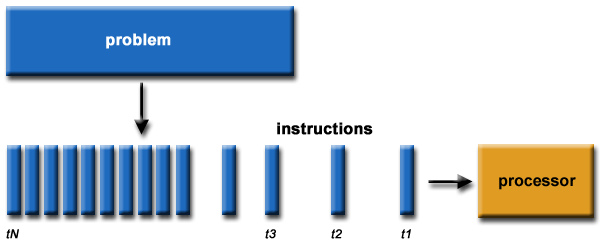
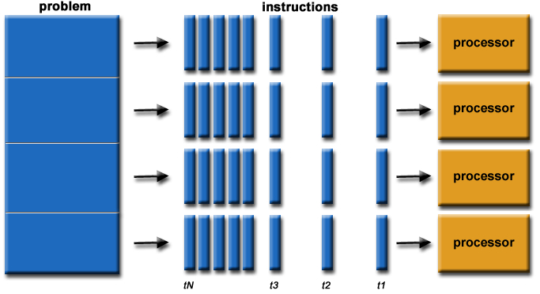

```{r librarysetup, include=FALSE}
library(rgdal) # package for shape files
library(sp)
library(rgeos) # rgeos package contains the intersect and area commands I need
library(dplyr)
library(data.table)
library(readxl)
# parallel computing libraries
# library(foreach) 
library(doParallel)
library(parallel)
library(readr)
```

```{r shapefile prepare, include=FALSE}
## Imoport WRF Grid file of Oregon
grid_dir <- paste0('../../../data/data_new/or_shapefile/oregon_grid.shp')
smoke_grid <- readOGR(dsn = grid_dir, layer = 'oregon_grid') # wrf_grid

## Import U.S. shapefile
shp_dir <- paste0('../../../data/data_original/', 
                 'tl_2013_us_zcta510/tl_2013_us_zcta510.shp')
us_zip_2013 <- readOGR(dsn = shp_dir, layer = 'tl_2013_us_zcta510')

## Filter the U.S. shapefile only to Oregon State Zip Code
read_path2 <- paste0('../../../data/data_original/oregon_zipcode.csv')
or_zip <- read_csv(read_path2)
names(or_zip) <- c('zip','type','city','county','area')
or_zip_map <- us_zip_2013[us_zip_2013$ZCTA5CE10 %in% or_zip$zip,]
or_zip <- as.character(sort(or_zip_map@data$ZCTA5CE10))

nad83 <- '+proj=longlat +datum=NAD83 +no_defs +ellps=GRS80 +towgs84=0,0,0'
proj4string(smoke_grid) <- nad83
```


## Background

**Goal:** Estimate population-weighted PM2.5 for each ZIP code.
<br/>
**Preparation:** 2013 Oregon Zip code Shapefile and WRF Grid
<br/>
**Problem:** The population data is for WRF Grid, not ZIP code.
<br/>
**First Step:** Calculate the proportion of intersection of ZIP code and grid box
*The plot below shows an Oregon State shapefile and an overlay of projected WRF Grid and Oregon shapefile.*
```{r overlay, echo=FALSE}
plot(or_zip_map)
plot(smoke_grid)
plot(or_zip_map, add=T)
```

**Example:** *Intersection for small area (Portland 97229); and big area (97910).*

```{r, echo = FALSE, warning=FALSE}
test_zip <- c(97229)
test_zip_map <- or_zip_map[or_zip_map$ZCTA5CE10 %in% test_zip,]

plot(test_zip_map)
plot(smoke_grid, add = T)
invisible(text(getSpPPolygonsLabptSlots(smoke_grid), 
               labels=as.character(smoke_grid$WRFGRID_ID)))

test_zip <- c(97910)
test_zip_map <- or_zip_map[or_zip_map$ZCTA5CE10 %in% test_zip,]

plot(test_zip_map)
plot(smoke_grid, add = T)

```


## Steps of calculating the proportion of intersection of a specific zip code polygon and WRF Grid.
1. Choose a zip code (94705 here) for testing. WRF Grid = 261 and 262. (6 WRF 
Grids in total. Only two are chosen for convenience)
```{r test, warning= FALSE, echo=FALSE}
test_zip <- c(97405)
test_zip_map <- or_zip_map[or_zip_map$ZCTA5CE10 %in% test_zip,]

plot(test_zip_map)
plot(smoke_grid, add = T)
invisible(text(getSpPPolygonsLabptSlots(smoke_grid), 
               labels=as.character(smoke_grid$WRFGRID_ID)))

```


2. The actual location in the map.
```{r, echo=FALSE}
# test zip map over zip grid
plot(smoke_grid)
plot(test_zip_map, add = T)
zip_over_grid <- over(test_zip_map, smoke_grid)
# summary(zip_over_grid) # this way retains the values
```


```{r include = FALSE}
# test_zip <- c(97405)
# test_zip_map <- or_zip_map[or_zip_map$ZCTA5CE10 %in% test_zip,]

# plot(test_zip_map)
# plot(smoke_grid, add = T)
# invisible(text(getSpPPolygonsLabptSlots(smoke_grid), 
#                labels=as.character(smoke_grid$WRFGRID_ID)))


shape_zip <- SpatialPolygons(test_zip_map@polygons)
shape_grid <- SpatialPolygons(smoke_grid@polygons)
plot(shape_zip)
plot(shape_grid, add = T)
# try and plot the values for this zipcode
invisible(text(getSpPPolygonsLabptSlots(smoke_grid), 
               labels=as.character(smoke_grid$WRFGRID_ID))) # grid width wider than previous map
```

```{r include = FALSE}
# output the WRF Grid 261 and 262 for test
wrf_grid_261 <- smoke_grid[smoke_grid@data$WRFGRID_ID == 261, ]
plot(wrf_grid_261)

wrf_grid_262 <- smoke_grid[smoke_grid@data$WRFGRID_ID == 262, ]
plot(wrf_grid_262)
```


```{r include = FALSE}
# calculate the area of grid 261 and 262
gArea(SpatialPolygons(wrf_grid_261@polygons))
gArea(SpatialPolygons(wrf_grid_262@polygons))
```


## Steps (Continued)
3. Show the intersection of chosen WRF Grid and zip code.
```{r show, warning=FALSE, echo=FALSE}
# Subset to one zip code and two different WRF grids ---------------------------
# plot zip and 2 grids
plot(test_zip_map)
#invisible(text(getSpPPolygonsLabptSlots(test_zip_map), 
#               labels=as.character(test_zip_map$ZCTA5CE10)))
plot(wrf_grid_261, add = T)
invisible(text(getSpPPolygonsLabptSlots(wrf_grid_261), 
               labels=as.character(wrf_grid_261$WRFGRID_ID)))
plot(wrf_grid_262, add=T)
invisible(text(getSpPPolygonsLabptSlots(wrf_grid_262), 
               labels=as.character(wrf_grid_262$WRFGRID_ID)))
```


4. The proportion of two WRF Grid.
```{r calculation, warning=FALSE, echo=FALSE}
# Start with the intersection with wrf grid 261 and zipcode
# first I need to convert the spatial polygon to just polygon
poly_261 <- SpatialPolygons(wrf_grid_261@polygons)
shape_zip <- SpatialPolygons(test_zip_map@polygons)

zip_261_int <- gIntersection(poly_261, shape_zip)
plot(zip_261_int)
plot(wrf_grid_261, add = T)
invisible(text(getSpPPolygonsLabptSlots(wrf_grid_261), 
               labels=as.character(wrf_grid_261$WRFGRID_ID)))

prop_261_int <- gArea(zip_261_int)/gArea(poly_261)
prop_261_int # 41.8% of grid is covered by zip

# now what about grid 262
poly_262 <- SpatialPolygons(wrf_grid_262@polygons)
shape_zip <- SpatialPolygons(test_zip_map@polygons)

zip_262_int <- gIntersection(poly_262, shape_zip)

plot(zip_262_int)
plot(wrf_grid_262, add = T)
invisible(text(getSpPPolygonsLabptSlots(wrf_grid_261), 
               labels=as.character(wrf_grid_261$WRFGRID_ID)))

prop_int_262 <- gArea(zip_262_int)/gArea(poly_262)
prop_int_262 # 6.0% of grid is covered by zip
```


## Why using for loop?

<ul class="incremental"> 
  <li> One choice: <br/>  simple calculation; copy and paste codes.</li> 
  <li> Another choice: for loop
  <br/> When analyzing big data set (for this data set, there are 417 zip codes 
  and 1610 WRF Grids in total), it is unrealistic to copy so many rows 
  (417*1610 = 671,370 times) of similar or same code.</li><br/>
  <li> And... <br/> Why using apply function? </li>
  <li> **Working Efficiency** <br/> **Vectorization.** Faster than for loop. It 
  works on margins of an array or matrix, not like for loop.</li> 
</ul> 


## Apply Family
>- Returns a vector or array or list of values obtained by applying a function to 
margins of an array or matrix.

>- The apply() Function
<br/> Apply functions over array margins.<br/>

>- The lapply() Function
<br/> Apply a function over a list or vector.<br/> 
Apply a given function to every element of a list and obtain a list as result.<br/>

An example: 
```{r, include = FALSE}
A <- matrix(1:4, 2, 2)
B <- matrix(5:10, 2, 3)
```

```{r}
L <- list(A, B)
lapply(L, "[", , 2)
```

>- The sapply() Function
<br/> Apply a function over a list or vector.<br/>
Works like lapply(), but it tries to simplify the output to the most elementary data structure that is possible. 

```{r}
L <- list(A, B)
sapply(L, function(x) x[ , 2])
```

>- The tapply() Function
<br/> Apply a function over a ragged array.

>- The mapply() Function
<br/> Apply a function to multiple list or vector arguments.


## Parallel on server





## Comparisons
**For loop vs Apply**

```{r prepare}
or_zip_name <- or_zip
length(or_zip_name)
wrf_grid_name <- as.character(smoke_grid@data$WRFGRID_ID)
length(wrf_grid_name)
# empty matrix
zip_wrf_proportion <- matrix(nrow = 417, ncol = 1610, byrow = T,
                             dimnames = list(or_zip_name, wrf_grid_name))

vars1 <- c(1:1610)
z <- rep(1:417, each=1610)
w <- rep(1:1610,417)
```

```{r parallel, eval = FALSE}
# Setup for parallel computing before for loop ---------------------------------
cores <- detectCores() # 48
cl <- makeCluster(cores) # use half the cores on the vet cluster
registerDoParallel(cl)
# load packages on each cluster
clusterCall(cl, function() library(rgdal))
clusterCall(cl, function() library(sp))
clusterCall(cl, function() library(rgeos))

clusterExport(cl, "or_zip_map", envir = .GlobalEnv)
clusterExport(cl, "or_zip_name", envir = .GlobalEnv)
clusterExport(cl, "smoke_grid", envir = .GlobalEnv)
clusterExport(cl, "wrf_grid_name", envir = .GlobalEnv)
clusterExport(cl, "zip_wrf_proportion", envir = .GlobalEnv)
clusterExport(cl, "z", envir = .GlobalEnv)
clusterExport(cl, "w", envir = .GlobalEnv)
clusterExport(cl, "vars1", envir = .GlobalEnv)

```

```{r parallel set, include = FALSE}
# Setup for parallel computing before for loop ---------------------------------
cores <- detectCores() # 48
cl <- makeCluster(cores) # use half the cores on the vet cluster
registerDoParallel(cl)
# load packages on each cluster
clusterCall(cl, function() library(rgdal))
clusterCall(cl, function() library(sp))
clusterCall(cl, function() library(rgeos))

clusterExport(cl, "or_zip_map", envir = .GlobalEnv)
clusterExport(cl, "or_zip_name", envir = .GlobalEnv)
clusterExport(cl, "smoke_grid", envir = .GlobalEnv)
clusterExport(cl, "wrf_grid_name", envir = .GlobalEnv)
clusterExport(cl, "zip_wrf_proportion", envir = .GlobalEnv)
clusterExport(cl, "z", envir = .GlobalEnv)
clusterExport(cl, "w", envir = .GlobalEnv)
clusterExport(cl, "vars1", envir = .GlobalEnv)

```

**1. Forloop** (one core, or not parallel computing)

```{r forloop}
start <- proc.time()
for (i in 1:417) {
  # output value of zipcode
  zipcode <- or_zip_name[i]
  # limit shapefile to particular zipcode
  zip_shape <- or_zip_map[or_zip_map$ZCTA5CE10 %in% zipcode, ]
  # convert to polygon
  zip_poly <-SpatialPolygons(zip_shape@polygons)
for(j in 1:1610){
    # output each grid and create a polygon
    wrf_grid <- smoke_grid[smoke_grid@data$WRFGRID_ID == j, ]
    wrf_poly <- SpatialPolygons(wrf_grid@polygons)
    
    zip_wrf_intersect <- gIntersection(wrf_poly, zip_poly)
    # if empty, then set to 0, else find the proportion
    grid_prop <- ifelse(is.null(zip_wrf_intersect),
                        0, gArea(zip_wrf_intersect)/gArea(wrf_poly))
    # populate the matrix based on i position and j position
    zip_wrf_proportion[[i,j]] <- grid_prop
  }
}
stop <- proc.time() - start
stop 
```

**2. Mapply function** (one core)

```{r mapply}
start <- proc.time()
f1 <- function(x){
  zipcode <- as.character(x) 
  # limit shapefile to particular zipcode
  zip_shape <- or_zip_map[or_zip_map$ZCTA5CE10 %in% zipcode, ]
  # convert to polygon
  zip_poly <-SpatialPolygons(zip_shape@polygons)
}
zip_polygon <- lapply(or_zip_name, f1) # list

f2 <- function(n){
  wrf_grid <- smoke_grid[smoke_grid@data$WRFGRID_ID == n,] # sp df
  # now what about grid 719; should be much less
  wrf_poly <- SpatialPolygons(wrf_grid@polygons) # sp
}
wrf_polygon <- lapply(vars1, f2) # list of 1610 wrf_grid

start <- proc.time()
f3 <- function(x,y){
  zip_wrf_intersect <- gIntersection(wrf_polygon[y][[1]], zip_polygon[x][[1]])
  grid_prop <- ifelse(is.null(zip_wrf_intersect),
                      0, gArea(zip_wrf_intersect)/gArea(wrf_polygon[y][[1]]))

}
proportion1 <- mapply(f3, z, w)
stop <- proc.time() - start
stop 

```

**One core vs Multiple cores**

**3. Mcmapply function** in parallel computing (multiple cores)

```{r mcmapply}
start <- proc.time()

f1 <- function(x){
  zipcode <- as.character(x) 
  # limit shapefile to particular zipcode
  zip_shape <- or_zip_map[or_zip_map$ZCTA5CE10 %in% zipcode, ]
  # convert to polygon
  zip_poly <-SpatialPolygons(zip_shape@polygons)
}
zip_polygon <- lapply(or_zip_name, f1) # list

f2 <- function(n){
  wrf_grid <- smoke_grid[smoke_grid@data$WRFGRID_ID == n,] # sp df
  # now what about grid 719; should be much less
  wrf_poly <- SpatialPolygons(wrf_grid@polygons) # sp
}
wrf_polygon <- lapply(vars1, f2) # list of 1610 wrf_grid

f3 <- function(x,y){
  zip_wrf_intersect <- gIntersection(wrf_polygon[y][[1]], zip_polygon[x][[1]])
  grid_prop <- ifelse(is.null(zip_wrf_intersect),
                      0, gArea(zip_wrf_intersect)/gArea(wrf_polygon[y][[1]]))

}
proportion <- mcmapply(f3, z, w)
stop <- proc.time() - start
stop 

stopCluster(cl)

```

## Another important thing:
Check if they are identical!
```{r, warning = FALSE, message = FALSE, echo = FALSE}
## write matrix of for loop formed
zip_proportion_df <- data.frame(zip_wrf_proportion)

write_path <- paste0('../../../data/data_new/',
                     'zip_wrf_proportion2.csv')
write_csv(zip_proportion_df, paste0(write_path))

## write matrix of apply function formed
zip_wrf_proportion_new <- matrix(proportion, nrow = 417, ncol = 1610, byrow = T,
                                    dimnames = list(or_zip_name, wrf_grid_name))

zip_proportion_new_df <- data.frame(zip_wrf_proportion_new)
write_path <- paste0('../../../data/data_new/',
                     'zip_wrf_proportion_new2.csv')
write_csv(zip_proportion_new_df, paste0(write_path))

read_path_1 <- paste0('../../../data/data_new/',
                     'zip_wrf_proportion2.csv')
zip_wrf_proportion_for <- read_csv(read_path_1)
read_path_2 <- paste0('../../../data/data_new/',
                     'zip_wrf_proportion_new2.csv')
zip_wrf_proportion_apply <- read_csv(read_path_2)

identical(zip_wrf_proportion_for, zip_wrf_proportion_apply)

```


